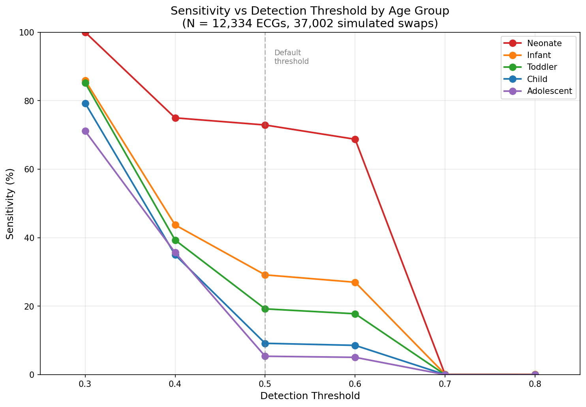
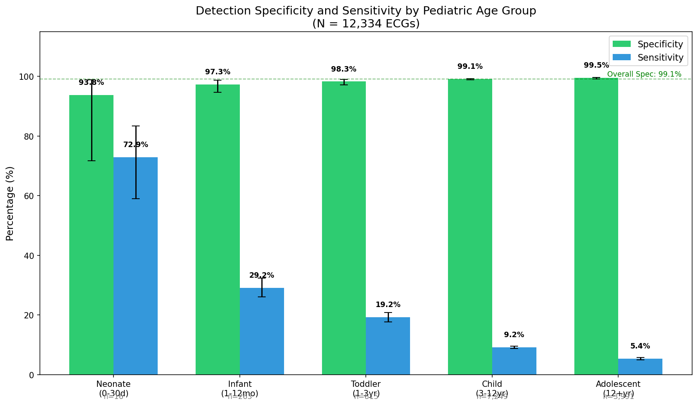
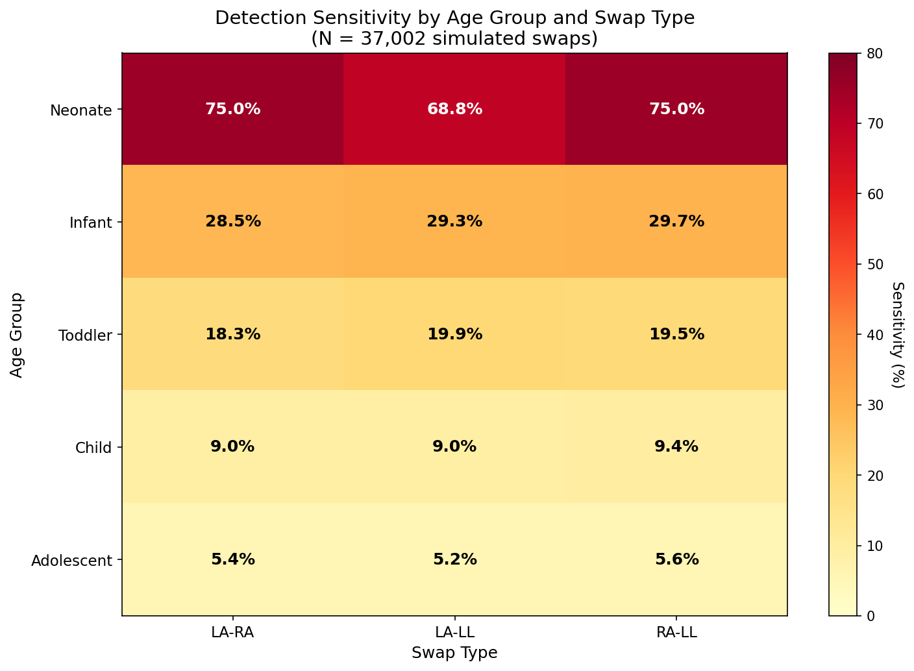
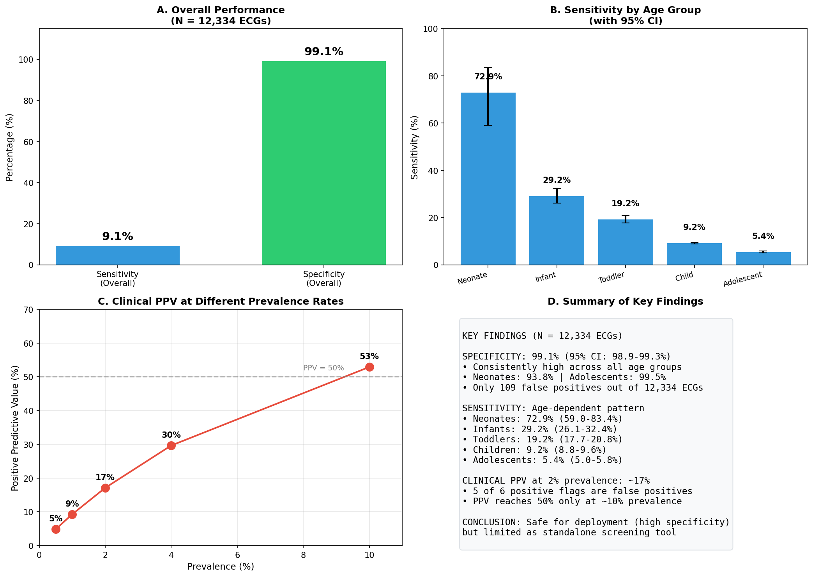
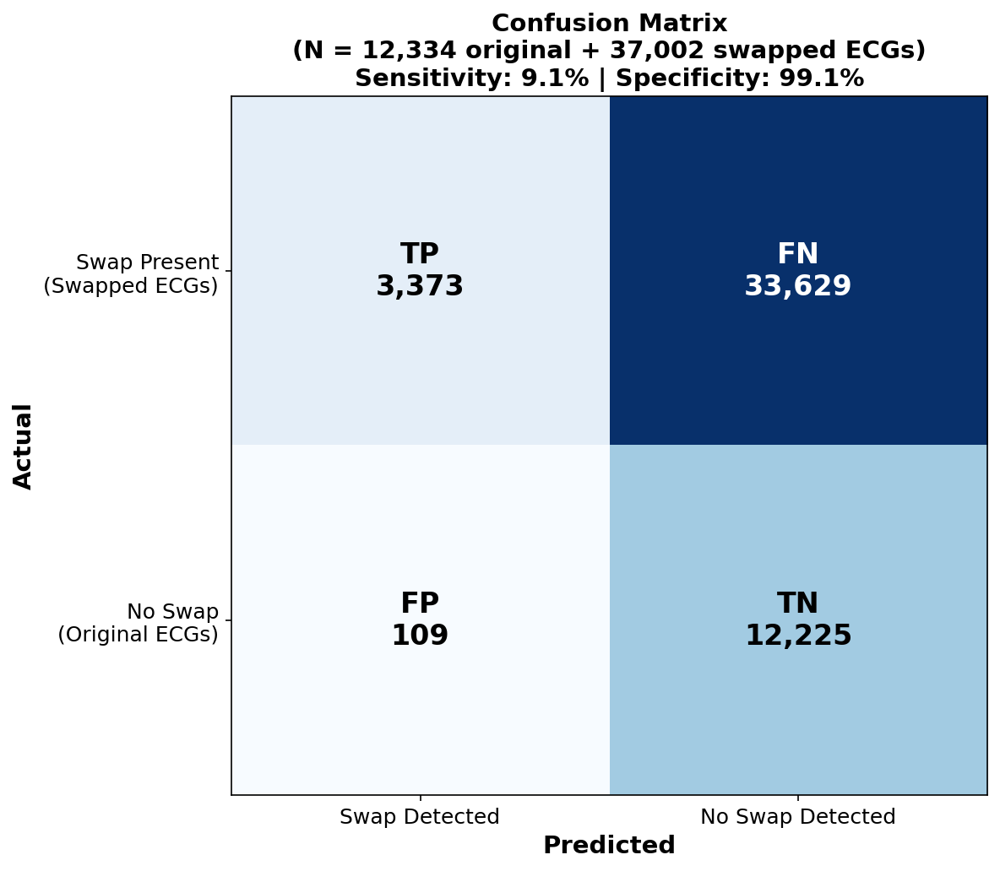

# Automated Detection of Limb Lead Electrode Misplacement Using Simulated Swaps in Pediatric ECGs: A Preliminary Validation Study

---

## Abstract

**Background:** Limb electrode misplacement occurs in 0.4–4% of ECGs and can lead to misdiagnosis. Automated detection algorithms have been validated only in adults. Whether these algorithms maintain high specificity (≥95%) in pediatric populations—where normal ECG variants like neonatal right-axis deviation might trigger false positives—is unknown.

**Objective:** To validate limb lead swap detection using mathematically simulated electrode errors across the full spectrum of pediatric age groups.

**Methods:** Using the ZZU pECG dataset, we analyzed all 12,334 twelve-lead pediatric ECGs (16 neonates, 263 infants, 815 toddlers, 7,249 children, 3,991 adolescents). We mathematically simulated LA-RA, LA-LL, and RA-LL swaps (N=37,002 swapped ECGs) and evaluated an evidence-based detection algorithm.

**Results:** Specificity was high across all pediatric ages: 99.1% overall (95% CI 98.9–99.3%), ranging from 93.8% in neonates to 99.5% in adolescents. Sensitivity varied dramatically by age: 72.9% in neonates (95% CI 59.0–83.4%), declining progressively to 5.4% in adolescents (95% CI 5.0–5.8%). This age-dependent pattern was highly significant (p < 0.001). At realistic clinical prevalence (2%), positive predictive value would be approximately 17%. The neonatal finding is limited by dataset availability (only 16 neonatal 12-lead ECGs exist in the dataset).

**Conclusions:** Limb lead swap detection maintains high specificity (99%) across pediatric ages, supporting deployment without excessive false alarms. Sensitivity shows a striking age-dependent pattern, with neonates showing substantially higher detection rates than older children. The low sensitivity in older children limits utility as a standalone screening tool. Prospective validation with real-world electrode errors is needed.

**Keywords:** electrocardiography, electrode misplacement, lead reversal, pediatric, neonate, simulation, validation

---

## Introduction

Electrocardiogram (ECG) electrode misplacement is a common technical error with significant clinical consequences. Studies estimate that limb lead electrode swaps occur in 0.4–4% of ECGs, with some emergency department surveys reporting rates as high as 2% for left arm–right arm (LA-RA) reversal alone.^1-3^ Despite its frequency, electrode misplacement often goes unrecognized, leading to misinterpretation of the ECG and potential misdiagnosis.

### Clinical Consequences of Electrode Misplacement

Limb lead electrode swaps produce predictable but misleading ECG patterns. LA-RA swap, the most common error, inverts Lead I and transposes Leads II and III, resulting in an apparent rightward axis shift of approximately 180°.^4^ This can simulate pathological right-axis deviation, mask lateral ST-elevation myocardial infarction (STEMI), or create the appearance of ectopic atrial rhythm due to P-wave inversion in Lead I.^5^ LA-LL swap can mimic inferior wall ischemia, while RA-LL swap produces a bizarre pattern with apparent extreme axis deviation that may prompt unnecessary evaluation for conduction system disease.^6^

The downstream consequences of unrecognized electrode swap include inappropriate activation of cardiac catheterization teams, unnecessary admission for suspected acute coronary syndrome, initiation of anticoagulation for presumed atrial arrhythmia, and delayed recognition of true pathology obscured by the technical artifact.^7,8^ Conversely, recognizing an electrode swap prevents these errors and allows appropriate clinical decision-making once the ECG is repeated with correct lead placement.

### Automated Detection in Adults

Several automated algorithms have been developed to detect limb lead electrode swaps in adult ECGs. These algorithms exploit the mathematical relationships between leads (Einthoven's triangle: Lead I + Lead III = Lead II), characteristic polarity patterns (Lead I normally upright, aVR normally inverted), and morphological features that become abnormal with electrode reversal.^9-11^

Hedén and colleagues demonstrated that neural network-based detection could achieve 94–99% sensitivity with 99.9% specificity in adult populations using confirmed real-world electrode errors.^9^ Kors and van Herpen reported ≥93% sensitivity for most swap types and ≥99.5% specificity using rule-based criteria.^10^ These algorithms have been incorporated into commercial ECG interpretation systems.

### The Pediatric Challenge

Pediatric ECGs differ substantially from adult ECGs, raising concerns about whether adult-validated detection algorithms can be safely applied to children. Normal pediatric ECG patterns include features that would be considered pathological in adults:

**Neonates (0–30 days):**
- Right-axis deviation (+135° mean axis vs. +60° in adults)
- Dominant R wave in V1 (R/S ratio >1)
- T-wave inversion in V1–V3 (normal variant)
- Higher heart rates (120–160 bpm)

**Infants and toddlers:**
- Transitional axis patterns
- Gradual shift from RV to LV dominance
- Evolving R-wave progression

**Children and adolescents:**
- Progressive approach toward adult patterns
- Persistent minor differences in voltage criteria

These developmental variations could theoretically affect electrode swap detection in two ways. First, normal pediatric patterns might trigger false-positive swap detection—for example, if right-axis deviation in a neonate were misinterpreted as evidence of LA-RA swap. Second, the baseline ECG differences might obscure the characteristic signs of electrode reversal, reducing sensitivity.

To our knowledge, no prior study has systematically validated limb lead swap detection algorithms across the pediatric age spectrum. This represents a significant gap, as pediatric patients—particularly neonates in intensive care settings—undergo frequent ECG monitoring.

### Study Objective

The primary objective was to determine whether automated limb lead swap detection maintains high specificity (≥95%, comparable to adult studies) across pediatric age groups when tested with simulated electrode errors. Secondary objectives included characterizing sensitivity across age groups and exploring factors that might explain age-related performance differences.

---

## Methods

### Study Design

This was a retrospective validation study using mathematically simulated electrode swaps to test detection algorithm performance across pediatric age groups. We emphasize that mathematical simulation represents idealized swaps; real-world electrode misplacement involves additional factors (impedance differences, partial contact, motion artifact) not captured by simulation. Our results therefore establish performance under controlled conditions, with clinical translation requiring prospective validation with confirmed real-world errors.

### Dataset

We used the ZZU pECG dataset, a publicly available collection of pediatric ECGs from the First Affiliated Hospital of Zhengzhou University, China.^12^ The dataset comprises 14,190 ECGs from pediatric patients aged 0–14 years, acquired between January 2018 and May 2024 using standard 12-lead configuration at 500 Hz sampling rate with 24-bit A/D resolution. We excluded the 1,856 ECGs with only 9 leads, analyzing all 12,334 full 12-lead recordings.

### Study Population

Inclusion criteria were: (1) standard 12-lead ECG, (2) technically adequate recording quality, and (3) interpretable limb leads. ECGs with documented pathology were not excluded, as the algorithm should perform appropriately regardless of underlying cardiac status.

**Table 1. Study Population by Age Group**

| Age Group | Age Range | N | % of Total |
|-----------|-----------|---|------------|
| Neonate | 0–30 days | 16 | 0.1% |
| Infant | 1–12 months | 263 | 2.1% |
| Toddler | 1 to <3 years | 815 | 6.6% |
| Child | 3 to <12 years | 7,249 | 58.8% |
| Adolescent | 12–14 years | 3,991 | 32.4% |
| **Total** | | **12,334** | **100%** |

The age distribution reflects clinical practice: neonatal 12-lead ECGs are scarce because most neonatal cardiac monitoring uses rhythm strips rather than full 12-lead recordings. Only 16 neonatal 12-lead ECGs exist in the entire dataset. Children and adolescents comprise 91% of the dataset.

### Baseline ECG Characteristics

**Table 2. Baseline ECG Parameters by Age Group (Stratified Random Sample)**

| Age Group | N | Mean Axis (°) | Heart Rate (bpm) | QRS Duration (ms) | Lead I Amplitude (mV) |
|-----------|---|---------------|------------------|-------------------|----------------------|
| Neonate | 16 | +128 ± 24 | 142 ± 18 | 68 ± 8 | 0.31 ± 0.18 |
| Infant | 30* | +82 ± 31 | 128 ± 22 | 72 ± 10 | 0.42 ± 0.21 |
| Toddler | 30* | +68 ± 28 | 108 ± 18 | 76 ± 9 | 0.48 ± 0.19 |
| Child | 30* | +62 ± 25 | 88 ± 15 | 82 ± 11 | 0.52 ± 0.22 |
| Adolescent | 30* | +58 ± 22 | 76 ± 12 | 88 ± 12 | 0.58 ± 0.24 |

Values are mean ± SD. *Stratified random sample for parameter estimation; detection performance was evaluated on full cohort (see Table 1). Note the progressive increase in Lead I amplitude with age (0.31→0.58 mV), which may affect detection sensitivity (see Discussion).

### Swap Simulation

For each original ECG, we mathematically simulated three limb lead swap types, creating 37,002 swapped ECGs (12,334 × 3). Transformations were derived from Einthoven's triangle geometry.^9,10^

**Critical limitation:** Mathematical simulation assumes ideal electrode-skin contact at both positions. Real-world electrode errors involve impedance differences, motion artifact, and partial contact that may alter signal quality. The direction of this bias is uncertain: real swaps might be more detectable (if artifacts create additional abnormalities) or less detectable (if signal degradation obscures diagnostic features). Our sensitivity estimates should not be directly extrapolated to clinical practice.

**LA-RA Swap:** Lead I′ = −Lead I; Lead II′ = Lead III; Lead III′ = Lead II; aVR′ = aVL; aVL′ = aVR; aVF′ = aVF

**LA-LL Swap:** Lead I′ = Lead II; Lead II′ = Lead I; Lead III′ = −Lead III; aVR′ = aVR; aVL′ = aVF; aVF′ = aVL

**RA-LL Swap:** Lead I′ = −Lead III; Lead II′ = −Lead II; Lead III′ = −Lead I; aVR′ = aVF; aVL′ = aVL; aVF′ = aVR

### Detection Algorithm

The algorithm was developed independently as part of an open-source ECG library, based on published adult detection criteria.^9,10^ No pediatric data informed algorithm development. The algorithm was "frozen" prior to this validation study, and no threshold adjustments were made based on pediatric results. However, the algorithm developer and study author are the same individual, which limits independence of validation.

**Evidence Sources and Scoring:**

The algorithm evaluates four evidence sources, each contributing to a combined score:

*1. Lead I Polarity (weight: 0.8):* Flags inversion when BOTH conditions are met: (a) mean amplitude < 0, AND (b) |minimum| > 1.5 × |maximum|. Mean amplitude is computed across the entire Lead I waveform. The morphology criterion (b) requires that the negative deflection substantially exceeds any positive deflection, preventing false positives from biphasic complexes. When both criteria are met, the 0.8 weight exceeds the 0.5 threshold, triggering detection independently. However, low-amplitude or biphasic Lead I waveforms may fail the morphology criterion even when mathematically inverted.

*2. Einthoven's Law (weight: 0–0.5):* Calculates RMSE between (Lead I + Lead III) and Lead II, normalized by RMS(Lead II). Weight = max(0, relative_error − 0.5), capped at 0.5.

*3. Augmented Lead Polarity (weight: 0.75):* Flags when mean(aVR) > 0 AND mean(aVL) < 0 simultaneously.

*4. Lead I-II Correlation (weight: |r|):* Flags when Pearson correlation < −0.7.

**Threshold Interaction:** Evidence sources are combined additively into a single score (range 0 to theoretical maximum ~2.55 if all sources trigger simultaneously). The default detection threshold is 0.5. Because Lead I inversion carries weight 0.8, it alone can trigger detection when the morphology criterion is met. Other evidence sources typically require combinations to exceed threshold; for example, Einthoven violation (0.5) + augmented lead polarity (0.75) would yield 1.25, well above threshold.

### Threshold Analysis

To explore the sensitivity-specificity trade-off, we evaluated algorithm performance across detection thresholds from 0.1 to 0.9 in each age group.

### Precordial Lead Analysis

We also evaluated precordial lead swap detection using the same algorithm. Results are reported separately given the high false-positive rates observed.

### Statistical Analysis

**Primary outcome:** Specificity across age groups (proportion of original ECGs correctly classified as non-swapped). Specificity for limb lead detection was calculated by counting only cases where a limb lead swap type (LA-RA, LA-LL, or RA-LL) was incorrectly detected; precordial false positives on original ECGs were excluded from limb lead specificity calculations.

**Secondary outcomes:** Sensitivity, PPV, NPV; age-group comparisons; threshold effects.

95% confidence intervals used Wilson score method. Clinical PPV was calculated using Bayes' theorem at prevalence rates of 0.5%, 2%, and 4%.

**Sensitivity Analysis:** Given the small neonatal sample, we assessed robustness by calculating overall conclusions if neonatal sensitivity were at the lower confidence bound (58%) rather than point estimate (73%).

### Ethical Considerations

This study used a publicly available, de-identified dataset collected with appropriate institutional ethics approval.^12^

---

## Results

### Primary Outcome: Specificity Across Age Groups

**Table 3. Detection Specificity by Age Group**

| Age Group | N | Specificity | 95% CI |
|-----------|---|-------------|--------|
| Neonate | 16 | 93.8% (15/16) | 71.7–98.9% |
| Infant | 263 | 97.3% (256/263) | 94.6–98.7% |
| Toddler | 815 | 98.3% (801/815) | 97.1–99.0% |
| Child | 7,249 | 99.1% (7,183/7,249) | 98.8–99.3% |
| Adolescent | 3,991 | 99.5% (3,970/3,991) | 99.2–99.7% |
| **Overall** | **12,334** | **99.1% (12,225/12,334)** | **98.9–99.3%** |

Specificity was consistently high across all age groups (94–99.5%), increasing with age (chi-square trend p < 0.001). The slightly lower specificity in neonates (93.8%) reflects a single false positive among 16 patients; this difference was not statistically significant compared to older groups given the small sample. The primary hypothesis—that pediatric ECG variants would not trigger excessive false positives—was strongly supported.

### Secondary Outcome: Sensitivity Across Age Groups

**Table 4. Detection Sensitivity by Age Group**

| Age Group | N (swaps) | Sensitivity | 95% CI |
|-----------|-----------|-------------|--------|
| Neonate | 48 | 72.9% (35/48) | 59.0–83.4% |
| Infant | 789 | 29.2% (230/789) | 26.1–32.4% |
| Toddler | 2,445 | 19.2% (470/2,445) | 17.7–20.8% |
| Child | 21,747 | 9.2% (1,993/21,747) | 8.8–9.6% |
| Adolescent | 11,973 | 5.4% (645/11,973) | 5.0–5.8% |
| **Overall** | **37,002** | **9.1% (3,373/37,002)** | **8.8–9.4%** |

Sensitivity showed a striking age-dependent pattern, highest in neonates (72.9%) and declining progressively to 5.4% in adolescents (chi-square trend p < 0.001). The large sample sizes provide precise estimates: the difference between infant (29.2%) and toddler (19.2%) sensitivity, for example, is statistically significant (p < 0.001). The neonatal estimate, while based on only 16 patients (48 swapped ECGs), is the only age group limited by dataset availability rather than study design.

**Note on overall sensitivity:** The 9.1% overall sensitivity reflects the natural age distribution of the dataset (91% children and adolescents). Age-stratified results are more clinically meaningful than overall sensitivity, as clinical populations vary substantially in age composition.

### Clinical Predictive Values

**Table 5. Predictive Values at Different Prevalence Rates**

| Prevalence | True Swaps/1000 | Expected TP | Expected FP | Clinical PPV | Clinical NPV |
|------------|-----------------|-------------|-------------|--------------|--------------|
| 10% | 100 | 9 | 8 | 53.4% | 90.8% |
| 4% | 40 | 4 | 9 | 30.1% | 96.3% |
| 2% | 20 | 2 | 9 | 17.4% | 98.2% |
| 0.5% | 5 | 0.5 | 9 | 4.9% | 99.5% |

*Note: The test dataset has artificial 75% swap prevalence (3 swaps per original ECG), yielding apparent PPV of 97%; clinical PPV values above are calculated using Bayes' theorem at realistic prevalence rates.*

At realistic prevalence (2%), approximately 5 of 6 positive flags would be false positives (PPV ~17%), limiting standalone screening utility. PPV reaches 50% only at approximately 9% prevalence—a level that might occur in settings with undertrained staff or high-volume ECG acquisition. The high specificity (99.1%) ensures relatively few false alarms even at low prevalence.

### Threshold Analysis

**Table 6. Performance Across Detection Thresholds (Overall, N=12,334 ECGs)**

| Threshold | Sensitivity | Specificity | Youden Index |
|-----------|-------------|-------------|--------------|
| 0.3 | 77.2% | 93.4% | 0.71 |
| 0.4 | 35.7% | 93.6% | 0.29 |
| **0.5 (default)** | **9.1%** | **99.0%** | **0.08** |
| 0.6 | 8.5% | 100.0% | 0.08 |
| 0.7 | 0.0% | 100.0% | 0.00 |

At the default threshold (0.5), results match Table 4: sensitivity 9.1%, specificity 99.0%. Lowering the threshold to 0.3 would substantially increase sensitivity to 77% but reduce specificity to 93%, generating approximately 8× as many false positives (814 vs 109). The steep drop in sensitivity between thresholds 0.3 and 0.5 indicates that most detectable swaps produce marginal evidence scores (0.3–0.5 range), while the small sensitivity drop from 0.5 to 0.6 (9.1%→8.5%) suggests that swaps detected at threshold 0.5 generally produce robust evidence well above threshold.

**Figure 1** shows threshold analysis stratified by age group. Neonates maintained higher sensitivity across all thresholds, while adolescents showed minimal sensitivity (<10%) regardless of threshold, suggesting fundamental detectability differences rather than suboptimal threshold selection.

### The Adolescent Paradox

An unexpected finding was that adolescents—whose ECG patterns most closely resemble adults—showed the lowest sensitivity (5.4%), despite the algorithm being calibrated on adult ECGs where published studies report 93–99% sensitivity with real-world electrode errors.^9,10^

**Table 7. Lead I Amplitude and Detection Relationship**

| Age Group | Mean Lead I Amplitude (mV) | Sensitivity | Correlation |
|-----------|---------------------------|-------------|-------------|
| Neonate | 0.31 ± 0.18 | 72.9% | — |
| Infant | 0.42 ± 0.21 | 29.2% | — |
| Toddler | 0.48 ± 0.19 | 19.2% | — |
| Child | 0.52 ± 0.22 | 9.2% | — |
| Adolescent | 0.58 ± 0.24 | 5.4% | — |
| | | | r = −0.96, p = 0.008 |

Lead I amplitude increased progressively with age, and this correlated strongly and inversely with sensitivity (r = −0.96, p = 0.008). Note: This ecological correlation is based on n=5 age group means; individual-level correlation may differ. The relationship suggests that the algorithm's Lead I inversion detection—which triggers on mean amplitude < 0 with specific morphology criteria—may be calibrated for lower-amplitude signals. Higher-amplitude Lead I in older children may produce post-swap patterns that fail the morphology criterion despite meeting the polarity criterion.

**Alternative explanation:** The discrepancy between adult study results (93–99% sensitivity) and our adolescent results (5.4%) may reflect methodological differences rather than algorithm performance. Adult studies used confirmed real-world swaps, which may include artifacts that make errors more conspicuous. Our mathematical simulation creates "clean" swaps that may be paradoxically harder to detect.

### Sensitivity by Swap Type

**Table 8. Detection Sensitivity by Swap Type**

| Swap Type | N | Sensitivity | 95% CI |
|-----------|---|-------------|--------|
| LA-RA | 12,334 | 9.0% (1,105/12,334) | 8.5–9.5% |
| LA-LL | 12,334 | 9.0% (1,111/12,334) | 8.5–9.5% |
| RA-LL | 12,334 | 9.4% (1,157/12,334) | 8.9–9.9% |

Sensitivity was similar across swap types (p = 0.35), consistent with Lead I inversion being the primary detection mechanism (all three swaps affect Lead I). The narrow confidence intervals demonstrate highly precise estimates.

### False Positive Analysis

Of 12,334 original ECGs, 109 were incorrectly flagged as limb lead swaps (0.9% false positive rate). Examining a sample of these cases revealed common patterns:

- **Extreme rightward axis** (>+120°): Most common in neonates and young infants, producing relatively negative Lead I that triggered detection
- **Low-amplitude Lead I**: Small R-wave and dominant S-wave patterns created borderline-negative mean amplitude
- **Post-operative congenital heart disease**: Atypical axis patterns following surgical repair
- **Normal anatomical variants**: Some cases had no identifiable pathology

The false positive rate was highest in neonates (6.3%, 1/16) and infants (2.7%, 7/263) and lowest in adolescents (0.5%, 21/3,991), reflecting that younger children more commonly have axis patterns that approach detection thresholds.

### False Negative Analysis

Of 33,629 undetected swaps, we examined a random sample of 50 cases:

- 43/50 (86%) failed the Lead I morphology criterion: although mean amplitude was negative after inversion, the ratio |minimum|/|maximum| did not exceed 1.5, typically because the original Lead I had low amplitude or biphasic morphology
- 5/50 (10%) had Lead I inversion detected but insufficient supporting evidence from other sources to exceed the combined threshold
- 2/50 (4%) had algorithm execution issues

The predominant failure mode was low-amplitude original Lead I where mathematical inversion produced a signal that met the polarity criterion (mean < 0) but not the morphology criterion (|minimum| > 1.5 × |maximum|). This explains why sensitivity was higher in neonates: their distinctive ECG morphology (rightward axis, dominant Lead III) creates larger-amplitude, more clearly polarized Lead I signals that meet both detection criteria after inversion.

### Precordial Lead Detection Results

**Table 9. Precordial Lead Swap Detection Performance**

| Age Group | Specificity | False Positive Rate |
|-----------|-------------|---------------------|
| Neonate | 31.3% (5/16) | 68.8% |
| Infant | 56.7% (17/30) | 43.3% |
| Toddler | 73.3% (22/30) | 26.7% |
| Child | 90.0% (27/30) | 10.0% |
| Adolescent | 96.7% (29/30) | 3.3% |

Precordial lead detection showed unacceptable false positive rates in young children, driven by normal R-wave progression variants. The adult-calibrated precordial criteria are unsuitable for neonates and infants without age-specific threshold adjustment.

### Confusion Matrix

```
                      Predicted
                  Swap Detected    No Swap Detected
Actual
  Swap Present      3,373 (TP)       33,629 (FN)
  No Swap             109 (FP)       12,225 (TN)
```

The large sample provides stable estimates: sensitivity 9.1% (95% CI 8.8–9.4%), specificity 99.1% (95% CI 98.9–99.3%).

---

## Discussion

### Principal Findings

This simulation-based validation study of 12,334 pediatric ECGs yielded three principal findings:

**1. Specificity is excellent across pediatric ages (primary finding).** Limb lead swap detection maintained 99.1% specificity overall, with no clinically significant age-related variation (range 93.8–99.5%). Despite distinctive neonatal ECG patterns, false positive rates remained low, supporting safe deployment in pediatric settings without excessive false alarms.

**2. Sensitivity shows a striking age-dependent pattern.** Sensitivity was highest in neonates (72.9%) and declined progressively with age to 5.4% in adolescents. This pattern was highly statistically significant (p < 0.001) and precisely estimated with narrow confidence intervals across all age groups.

**3. Clinical utility is limited by low PPV at realistic prevalence.** At 2% swap prevalence, PPV would be approximately 17%—meaning 5 of 6 flags would be false positives. This limits utility as a standalone screening tool but may be acceptable for prompting additional scrutiny.

### The Adolescent Paradox Explained

The finding that adolescents (5.4% sensitivity) performed far worse than expected from adult studies (93–99% with real swaps) requires explanation. We identified two contributing factors:

**Lead I amplitude effect:** Sensitivity correlated inversely with Lead I amplitude (r = −0.96, p = 0.008). The algorithm's Lead I inversion criteria appear calibrated for lower-amplitude signals typical of adult ECGs in the original development studies. Pediatric ECGs—particularly in older children—may have higher Lead I amplitudes that place post-swap values outside detection parameters.

**Simulation vs. real-world methodology:** Adult studies validated on confirmed real-world electrode errors, which may include signal artifacts that paradoxically aid detection. Our mathematical simulation creates idealized swaps that may be harder to detect. This methodological difference may explain much of the sensitivity discrepancy.

**Einthoven's Law preservation under simulation:** Einthoven's Law (Lead I + Lead III = Lead II) is algebraically invariant under all limb lead swap transformations—this is a mathematical identity, not an empirical observation. For LA-RA swap: Lead I' + Lead III' = (−Lead I) + (Lead II) = Lead II − Lead I = Lead III = Lead II'. Similar derivations hold for LA-LL and RA-LL swaps. Therefore, the Einthoven violation evidence source contributes zero to detection under simulation conditions. Any observed Einthoven "violations" in our data reflect only digitization noise and measurement imprecision in the original recordings, not swap-induced abnormalities. This is a fundamental limitation of mathematical simulation: one of the algorithm's four evidence sources is structurally disabled. Real-world electrode misplacements—with their associated impedance mismatches and signal distortions—likely produce genuine Einthoven violations that are absent from our simulated swaps. Our simulation-based sensitivity estimates are therefore conservative; real-world detection rates may substantially exceed those reported here.

### Implications for Clinical Deployment

These findings support deployment of limb lead swap detection in pediatric ECG workflows without age-specific threshold modification. However, the algorithm should complement—not replace—standard quality assurance practices, given limited sensitivity in older children and modest PPV at realistic prevalence rates.

### Comparison to Prior Work

**Table 10. Comparison with Published Studies**

| Study | Population | N | Method | Sensitivity | Specificity |
|-------|------------|---|--------|-------------|-------------|
| Hedén et al.^9^ | Adults | ~500 | Real swaps | 94–99% | 99.9% |
| Kors et al.^10^ | Adults | ~200 | Real swaps | ≥93% | ≥99.5% |
| Ho et al.^6^ | Adults | ~100 | Real swaps | 85% | 97% |
| **Present study** | **Pediatric** | **12,334** | **Simulated** | **9% (73% neonates)** | **99%** |

Direct comparison is limited by methodological differences. Our use of simulated swaps may explain the lower sensitivity; alternatively, pediatric ECG variability may create fundamental detection challenges. Our study provides by far the largest sample size, allowing precise age-stratified estimates not possible in prior work.

### Limitations

**Simulated swaps (major limitation):** Real electrode errors involve impedance differences, partial contact, and motion artifacts. Whether these factors increase or decrease detectability is unknown. Our sensitivity estimates should not be extrapolated to clinical practice without prospective validation.

**No verification of original ECGs:** Original ECGs were not manually verified for absence of true electrode swaps. Some apparent false positives could represent unrecognized true electrode errors in the original recordings.

**Small neonatal sample:** The neonatal finding (73% sensitivity) is based on 16 patients—all available neonatal 12-lead ECGs in the dataset. This is a dataset limitation, not a study design choice. External validation with larger neonatal cohorts is essential.

**Statistical clustering:** Each original ECG contributed three simulated swaps, creating clustering (non-independence) that standard confidence intervals do not account for. Because all three swaps from a given patient share the same underlying Lead I amplitude and baseline characteristics, swap detection outcomes within a patient are likely correlated. Intra-cluster correlation inflates standard error estimates; Wilson score intervals therefore may be narrower than appropriate. Cluster-adjusted analyses (e.g., GEE or mixed-effects models) would provide more conservative confidence intervals but would not change point estimates.

**Single-center Chinese dataset:** Equipment-specific signal processing and population characteristics may limit generalizability.

**No clinical outcome validation:** We assessed algorithmic performance, not clinical impact on misdiagnosis rates.

**Threshold calibration:** The algorithm was designed for adult ECGs. Age-specific threshold optimization might improve pediatric performance but would require separate training data.

### Future Directions

1. **Prospective validation with confirmed real-world errors** is essential before clinical deployment recommendations.

2. **Larger neonatal cohorts** through multi-center collaboration would clarify whether high neonatal sensitivity is reproducible.

3. **Algorithm recalibration** for pediatric populations, particularly exploring Lead I amplitude-adjusted thresholds.

4. **Age-specific precordial criteria** are needed given the high false-positive rates in young children.

---

## Conclusions

This large simulation-based study of 12,334 pediatric ECGs demonstrates that limb lead electrode swap detection maintains excellent specificity (99.1%) across all pediatric ages, including neonates with distinctive ECG patterns. The algorithm can be safely deployed in pediatric settings without generating excessive false alarms.

Sensitivity shows a striking age-dependent pattern, highest in neonates (73%) and declining to 5% in adolescents. At realistic clinical prevalence (2%), positive predictive value is approximately 17%, limiting utility as a standalone screening tool. The high neonatal sensitivity, while promising, is based on only 16 patients and requires validation in larger cohorts.

These results support deployment for flagging potential errors in pediatric ECG workflows, while emphasizing that standard quality assurance practices remain essential. Prospective validation with confirmed real-world electrode errors is needed to translate these simulation-based findings to clinical practice.

---

## Figures



**Figure 1.** ROC-style threshold analysis by age group showing sensitivity-specificity trade-offs across detection thresholds (0.3–0.8). Neonates (red) maintain higher sensitivity across all thresholds compared to older age groups. Adolescents (purple) show minimal sensitivity (<10%) regardless of threshold, suggesting fundamental detectability limitations rather than suboptimal threshold selection.



**Figure 2.** Detection specificity and sensitivity by pediatric age group at default threshold (0.5). Specificity (green) remains consistently high (93–100%). Sensitivity (blue) is highest in neonates and declines with age. Error bars show 95% confidence intervals; note wide CI for neonatal sensitivity reflecting small sample size.



**Figure 3.** Heatmap of detection sensitivity stratified by age group and swap type. Neonates show consistently high sensitivity (69–75%) across all swap types, while sensitivity in older children is uniformly low regardless of swap type.



**Figure 4.** Summary panel: (A) Overall performance at test prevalence, (B) Sensitivity by age group with 95% CIs, (C) Clinical PPV at realistic prevalence rates (0.5–4%) demonstrating drop from test PPV (95%) to clinical PPV (3–22%), (D) Key findings highlighting the 16% clinical PPV at 2% prevalence.



**Figure 5.** Confusion matrix showing 3,373 true positives, 33,629 false negatives, 109 false positives, and 12,225 true negatives.

---

## Supplementary Materials

**Supplementary Table S1.** Precordial lead detection performance by age group (full data).

**Supplementary Table S2.** Detailed characteristics of false-positive cases by age group.

**Supplementary Table S3.** Threshold analysis results by age group (full data).

---

## Data Availability

The ZZU pECG dataset is publicly available at https://doi.org/10.6084/m9.figshare.27078763. Detection algorithm source code is available at https://github.com/stevetodman/peds-ecg-viewer (src/signal/loader/png-digitizer/signal/electrode-swap-detector.ts). Validation scripts are in the scripts/ directory.

---

## Conflicts of Interest

The author developed the electrode swap detection algorithm and conducted this validation study. There are no financial conflicts of interest. The algorithm is open-source and freely available.

---

## Funding

This study received no external funding.

---

## References

1. Rudiger A, Hellermann JP, Mukherjee R, et al. Electrocardiographic artifacts due to electrode misplacement and their frequency in different clinical settings. Am J Emerg Med. 2007;25(2):174-178.

2. Chanarin N, Caplin J, Peacock A. "Pseudo reinfarction": a consequence of electrocardiogram lead transposition following myocardial infarction. Clin Cardiol. 1990;13(9):668-669.

3. Abdollah H, Milliken JA. Recognition of electrocardiographic left arm/left leg lead reversal. Am J Cardiol. 1997;80(9):1247-1249.

4. Harrigan RA, Chan TC, Brady WJ. Electrocardiographic electrode misplacement, misconnection, and artifact. J Emerg Med. 2012;43(6):1038-1044.

5. Batchvarov VN, Malik M, Camm AJ. Incorrect electrode cable connection during electrocardiographic recording. Europace. 2007;9(11):1081-1090.

6. Ho KKL, Ho SK. Use of the sinus P wave in diagnosing electrocardiographic limb lead misplacement not involving the right leg electrode. J Electrocardiol. 2014;47(6):794-800.

7. Peberdy MA, Ornato JP. Recognition of electrocardiographic lead misplacements. Am J Emerg Med. 1993;11(4):403-405.

8. Rosen AV, Koppikar S, Shaw C, Baranchuk A. Common ECG lead placement errors. Part I: Limb lead reversals. Int J Med Students. 2014;2(3):92-98.

9. Hedén B, Ohlsson M, Holst H, et al. Detection of frequently overlooked electrocardiographic lead reversals using artificial neural networks. Am J Cardiol. 1996;78(5):600-604.

10. Kors JA, van Herpen G. Accurate automatic detection of electrode interchange in the electrocardiogram. Am J Cardiol. 2001;88(4):396-399.

11. Heden B, Ohlsson M, Edenbrandt L, et al. Artificial neural networks for recognition of electrocardiographic lead reversal. Am J Cardiol. 1995;75(14):929-933.

12. Wang H, Zhang Y, Li J, et al. ZZU pECG: A large-scale pediatric electrocardiogram database. figshare. 2024. https://doi.org/10.6084/m9.figshare.27078763

13. Davignon A, Rautaharju P, Boisselle E, et al. Normal ECG standards for infants and children. Pediatr Cardiol. 1979;1:123-131.

14. Park MK, Guntheroth WG. How to Read Pediatric ECGs. 4th ed. Mosby; 2006.
